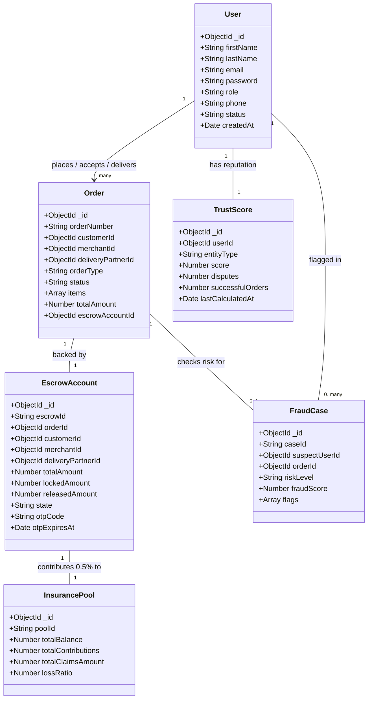
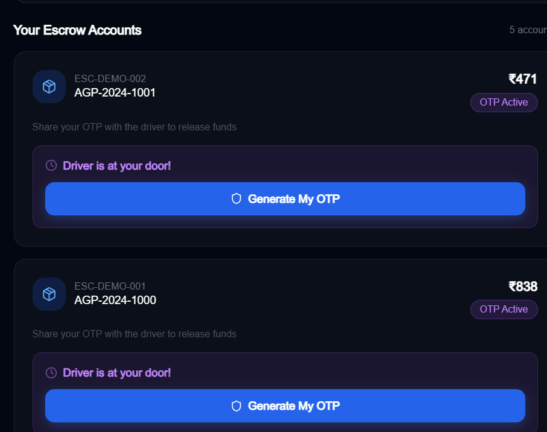
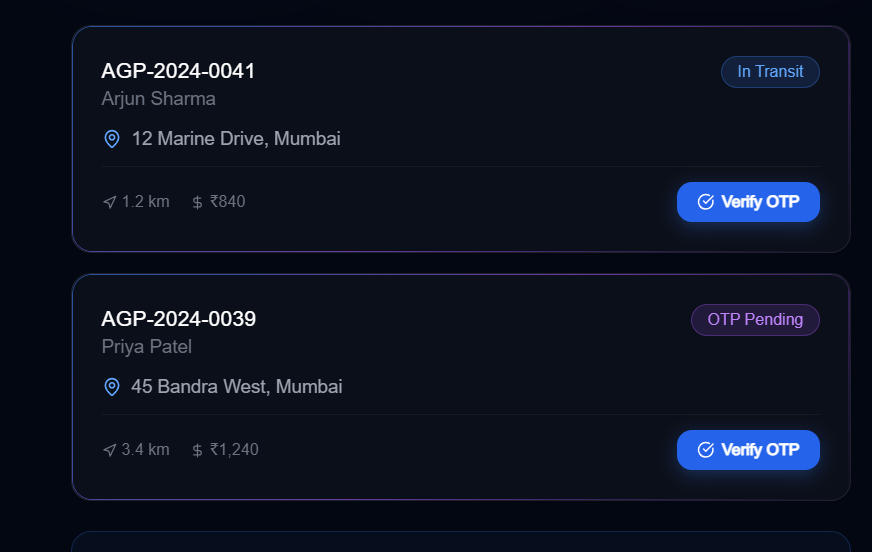
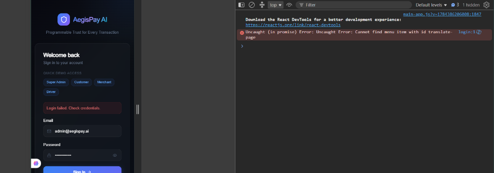
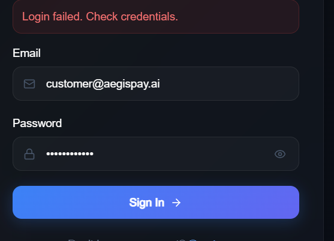

# 🛡️ AegisPay AI
### "Programmable Trust for Every Transaction"

> AI-powered programmable escrow and settlement infrastructure for real-time commerce.

---

## ⚡ Quick Start (5 Minutes)

### Step 1 — Install 3 Free Tools

| Tool | Download |
|------|----------|
| **Node.js** (v20+) | https://nodejs.org → click "LTS" → install |
| **Python** (3.11+) | https://python.org → click "Downloads" → install |
| **MongoDB Community** | https://www.mongodb.com/try/download/community → install |

> ✅ During MongoDB install: choose "Install MongoDB as a Service" — this means it starts automatically.

### Step 2 — First-Time Setup

```
Double-click:  setup.bat
```

This will automatically:
- Install all Node.js packages (~2-3 min)
- Install all Python packages (~1-2 min)
- Create your `.env` configuration file
- Seed the database with default accounts and active test escrows

### Step 3 — Start the App

```
Double-click:  start.bat
```

Wait ~30 seconds, then open: **http://localhost:3000**

### Step 4 — Log In

| Role | Email | Password |
|------|-------|----------|
| Super Admin | admin@aegispay.ai | Admin@123456 |
| Customer | customer@aegispay.ai | Admin@123456 |
| Merchant | merchant@aegispay.ai | Admin@123456 |
| Driver | driver@aegispay.ai | Admin@123456 |

---

## 🏗️ What's Running

After `start.bat`, you'll have 3 services running:

| Service | URL | What it does |
|---------|-----|-------------|
| **Frontend** | http://localhost:3000 | The web app you interact with |
| **Backend API** | http://localhost:4000 | Handles all business logic |
| **API Docs** | http://localhost:4000/api/docs | Swagger API documentation |
| **AI Service** | http://localhost:8000 | Fraud & trust AI |
| **AI Docs** | http://localhost:8000/docs | AI service documentation |

---

## 🔄 End-to-End Workflow

This activity diagram illustrates the step-by-step transaction flow, showing how payment locks in escrow, runs through real-time AI fraud checks, transitions to delivery, and settles securely via customer-generated OTP verification.

```mermaid
graph TD
    %% Define Styles
    classDef startEnd fill:#10b981,stroke:#047857,stroke-width:2px,color:#fff;
    classDef process fill:#1e293b,stroke:#475569,stroke-width:1.5px,color:#f8fafc;
    classDef decision fill:#8b5cf6,stroke:#6d28d9,stroke-width:1.5px,color:#fff;
    classDef alert fill:#ef4444,stroke:#b91c1c,stroke-width:2px,color:#fff;

    Start([1. Customer Places Order]) :::startEnd --> API[API receives request] :::process
    API --> AI_Check{2. Run AI Fraud Check} :::decision
    
    %% Fraud Outcomes
    AI_Check -- Risk > 80 <br>CRITICAL --> Block[Auto-Cancel Order & Alert] :::alert
    Block --> EndBlock([Transaction Rejected]) :::startEnd
    
    AI_Check -- Risk < 80 <br>LOW/HIGH --> LockFunds[3. Lock funds in Escrow Vault] :::process
    LockFunds --> InsuranceFee[4. Skim 0.5% to Insurance Pool] :::process
    InsuranceFee --> Kitchen[5. Order sent to Merchant Kitchen] :::process
    
    Kitchen --> Pickup[6. Driver picks up order] :::process
    Pickup --> Transit[7. Status set to IN_TRANSIT] :::process
    
    Transit --> Arrival[8. Driver arrives at Customer] :::process
    Arrival --> GenOTP[9. Customer generates 6-digit OTP] :::process
    GenOTP --> ShareOTP[10. Customer shares OTP with Driver] :::process
    
    ShareOTP --> EnterOTP[11. Driver enters OTP in app] :::process
    EnterOTP --> VerifyOTP{12. Server bcrypt matches?} :::decision
    
    %% OTP Verification Outcomes
    VerifyOTP -- No --> RetryOTP[Show Error & Prompt Retry] :::process
    RetryOTP --> EnterOTP
    
    VerifyOTP -- Yes --> Settlement[13. Transition Escrow to SETTLED] :::process
    Settlement --> ReleaseFunds[14. Release payout to Merchant & Driver] :::process
    ReleaseFunds --> Reputation[15. Event: Increment Driver Trust Score +1] :::process
    Reputation --> EndSuccess([Order Completed]) :::startEnd
```

---

## 📊 Database Domain Model (Class Diagram)

Below is the database relationship mapping for AegisPay AI.



---

## 📷 App Screenshots & Interfaces

Here are the visual interfaces of the various roles and flows:

### 1. Customer Escrow & OTP Screen
The Customer Escrow page shows the active funds protected in the secure vault, alongside the animated, springy 6-digit OTP cards generated when the driver arrives.



### 2. Driver Delivery Portal
The Driver Portal shows assigned deliveries, mapping active escrows (`ESC-DEMO-001` and `ESC-DEMO-002`) and prompting OTP verification at the doorstep.



### 3. Super Admin & System Dashboards
The central command console showing metrics, active settlements, and overall platform statistics.




---

## 🔧 Troubleshooting

**"MongoDB not found" error:**
- Open Windows Search → type "MongoDB Compass".
- If it opens, MongoDB is running. Run `start.bat` again.
- If not: download from https://www.mongodb.com/try/download/community.

**"Port already in use" error:**
- Run `stop.bat` first, then run `start.bat` again.

**"Module not found" error:**
- Run `setup.bat` again to install any missing modules.

---

## 📝 License

MIT — Free to use and modify.

---

*Built by sadashiv*
